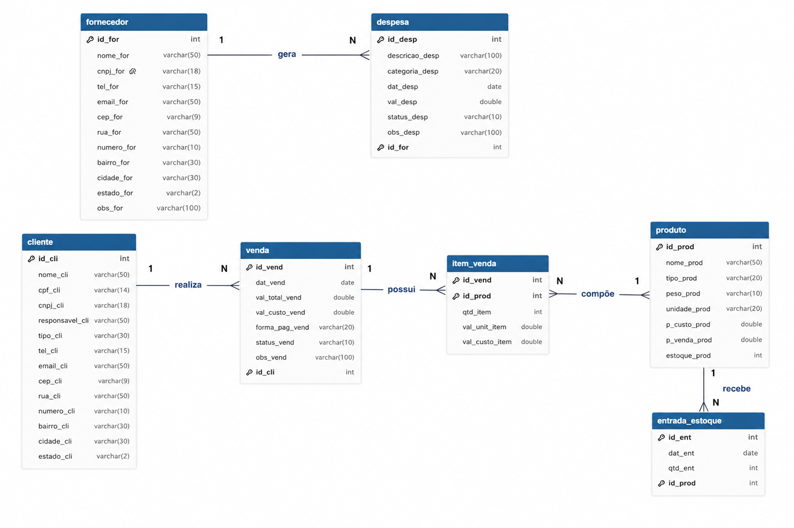
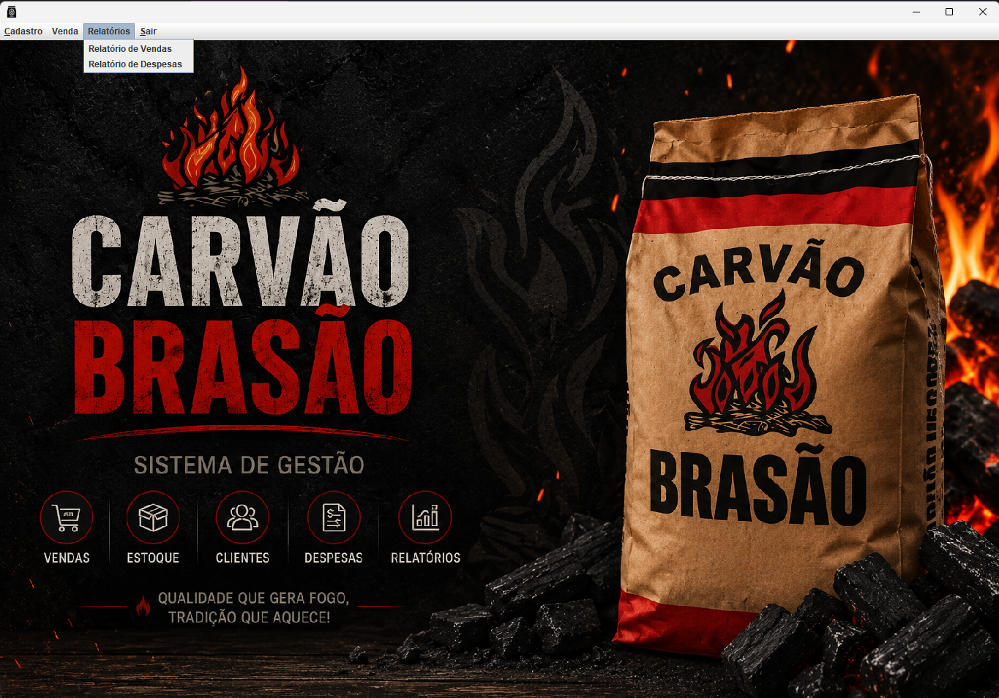
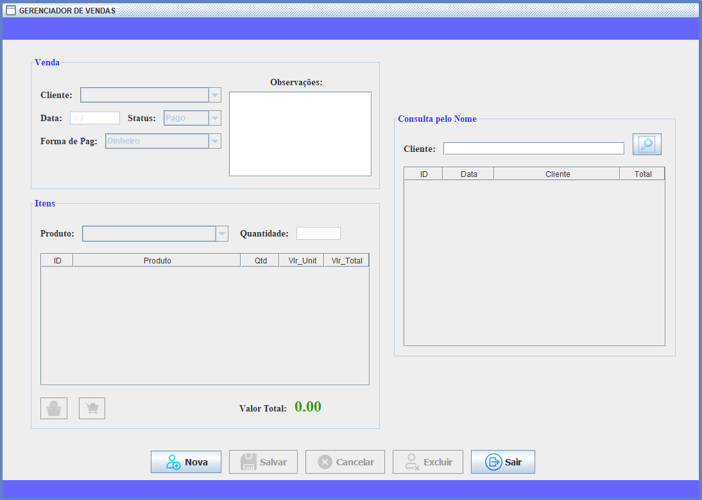
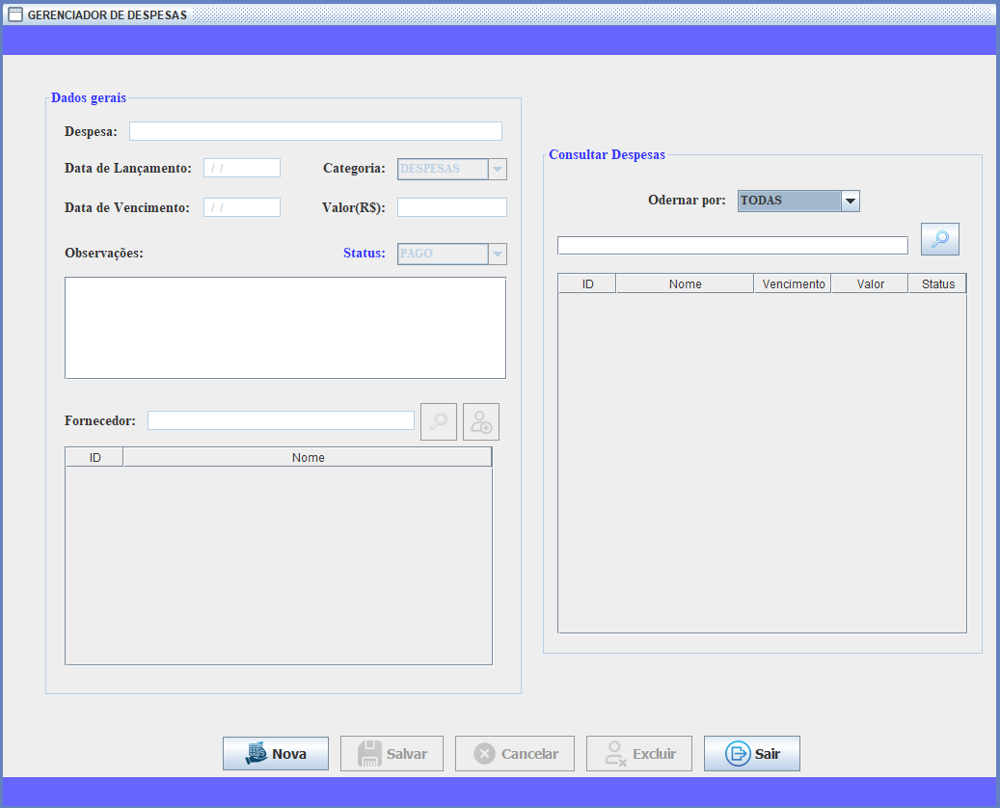
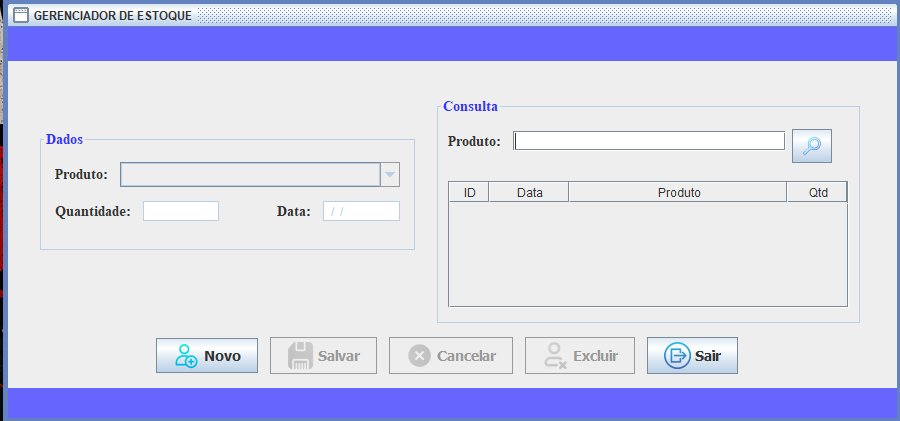
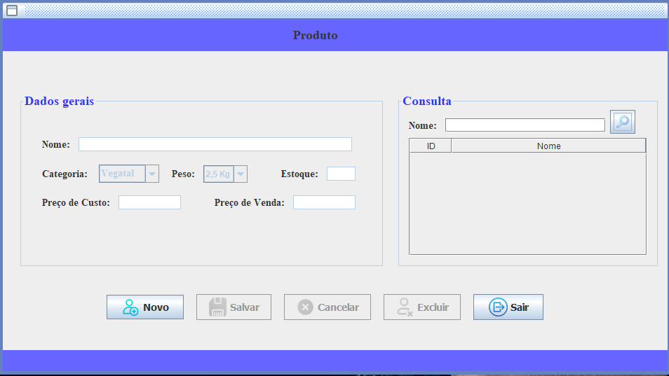
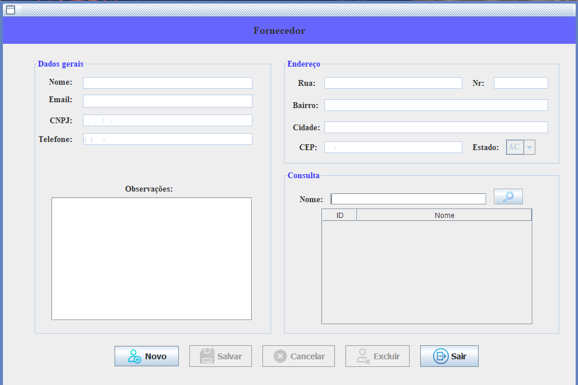
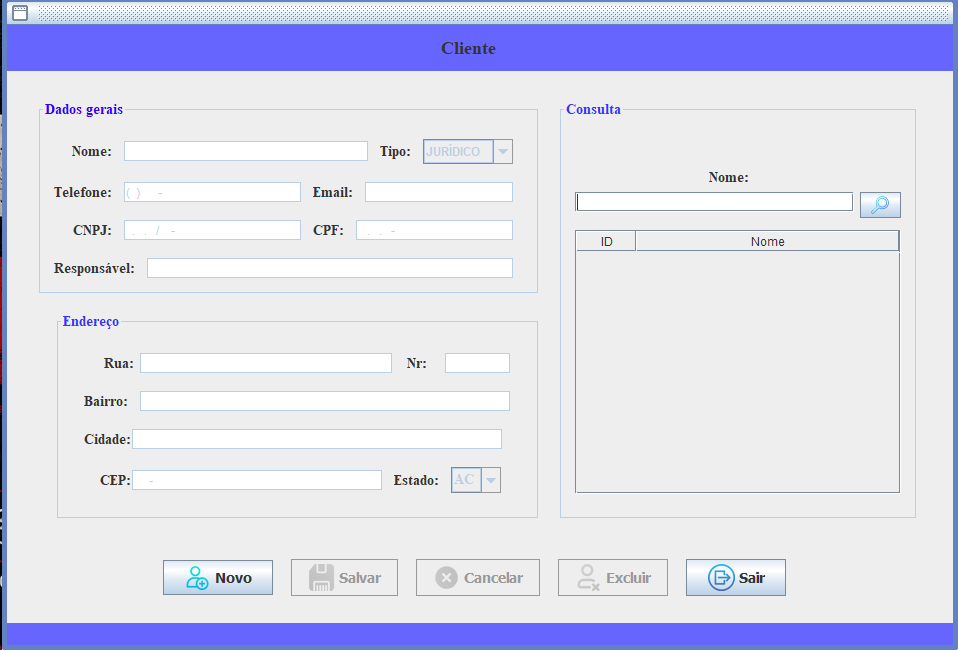

# 🪨 Sistema de Gestão de Distribuidora de Carvão

> Projeto acadêmico desenvolvido com base em um caso de uso real — sistema de gestão para uma distribuidora de carvão da região de Fernandópolis-SP.

---

## 📋 Sobre o Projeto

Este sistema foi desenvolvido como projeto de avaliação acadêmica no curso de **Sistemas de Informação — IFSP Votuporanga**, com aplicação prática real: controle de uma distribuidora de carvão que atende bares, churrascarias e mercados da região.

O sistema cobre todo o fluxo da operação: cadastro de fornecedores, produtos e clientes, lançamento de entradas de estoque, registro de vendas com cálculo automático de totais, cadastro de despesas com vínculo a fornecedor e geração de relatórios em PDF.

---

## 🚀 Funcionalidades

- ✅ Cadastro de **Fornecedores** com endereço completo
- ✅ Cadastro de **Produtos** (carvão vegetal, mineral e de coco em diferentes gramagens)
- ✅ Cadastro de **Clientes** — Pessoa Física e Jurídica
- ✅ **Entrada de Estoque** com atualização automática da quantidade disponível
- ✅ **Lançamento de Vendas** com múltiplos itens, cálculo de total e desconto automático do estoque
- ✅ **Cadastro de Despesas** com data de lançamento, vencimento, status (Pago / Em Aberto) e vínculo opcional a fornecedor
- ✅ **Pesquisa de Despesas** por descrição, status ou mês/ano de vencimento (formato MM/AAAA)
- ✅ **Relatório de Vendas** com total vendido por período (JasperReports)
- ✅ **Relatório de Despesas** com status de pagamento e totais
- ✅ Validações de campos obrigatórios e regras de negócio em todas as telas

---

## 🗄️ Modelagem do Banco de Dados



| Tipo | Relacionamento |
|---|---|
| Entidades independentes | `fornecedor`, `produto`, `cliente` |
| 1:N | `cliente` → `venda` |
| 1:N | `produto` → `entrada_estoque` |
| N:N | `venda` ↔ `produto` via `item_venda` |
| 1:N (opcional) | `fornecedor` → `despesa` |

---

## 🛠️ Tecnologias Utilizadas

| Tecnologia | Uso |
|---|---|
| Java 8 | Linguagem principal |
| Java Swing | Interface gráfica (GUI) |
| PostgreSQL | Banco de dados relacional |
| JDBC | Conexão Java ↔ PostgreSQL |
| JasperReports 5.6 | Geração de relatórios em PDF |
| NetBeans 15 | IDE de desenvolvimento |

---

## 🏗️ Arquitetura

O projeto segue o padrão **MVC** com separação em 4 camadas:

```
src/
└── br/com/distribuidoraBrasao/
    ├── dto/        # Objetos de transferência de dados (atributos das entidades)
    ├── dao/        # Acesso ao banco de dados (SQL via JDBC)
    ├── ctr/        # Controladores (intermediários entre DAO e VIEW)
    ├── view/       # Telas (JInternalFrame via Swing)
    └── rels/       # Relatórios (.jrxml e .jasper)
```

---

## ⚙️ Como Executar

### Pré-requisitos

- Java 8 ou superior
- PostgreSQL instalado e rodando
- NetBeans 15 (ou outra IDE Java com suporte a projetos Ant)

### Configuração do Banco

1. Crie o banco de dados:
```sql
CREATE DATABASE distribuidoraBrasao;
```

2. Execute o script SQL disponível em `Script banco de dados.txt`

### Configuração da Conexão

Abra `src/br/com/distribuidoraBrasao/dao/ConexaoDAO.java` e ajuste:

```java
String dsn   = "distribuidoraBrasao";          // nome do banco
String user  = "postgres";                     // seu usuário
String senha = "sua_senha";                    // sua senha
```

### Executando

Abra o projeto no NetBeans e execute a classe principal `DistribuidoraBrasao.java`.

---

## 📸 Telas do Sistema

### Tela Principal


### Menu Relatórios


### Gerenciador de Vendas


### Gerenciador de Despesas


### Gerenciador de Estoque


### Cadastro de Produto


### Cadastro de Fornecedor


### Cadastro de Cliente


---

## 👨‍💻 Autor

**Leonardo Tsuzuki de Almeida**

- GitHub: [@LeoTsuzuki](https://github.com/LeoTsuzuki)
- LinkedIn: [linkedin.com/in/leonardotsuzuki](https://linkedin.com/in/leonardotsuzuki)

---

## 📚 Contexto Acadêmico

Desenvolvido como projeto de avaliação da disciplina de Programação no curso de **Sistemas de Informação — IFSP Votuporanga** (3º semestre), seguindo o padrão MVC com DAO/DTO/CTR/VIEW ensinado em aula.
